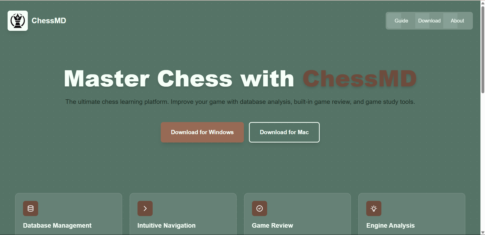

# SiteMD (Website for ChessMD)

This is the website that will eventually be hosted at [chessmd.org](https://chessmd.org/), for ChessMD, a chess learning and analysis platform project.



## Features

- Working download links!
- Cool minimalistic UI
- Highlights app features containing screenshots
- Features a guide
- About page
- cool hover effects (only on the home page)

## Tech Stack

- Next.js
- React
- Tailwind CSS

## Link

[Link to deployment](https://chessmd.org/)

## Running locally

Install the required dependencies by running:

```bash
npm install
```

Then start the dev server by running:

```bash
npm run dev
```

Then open your web browser and go to [http://localhost:3000](http://localhost:3000) to view the app.
